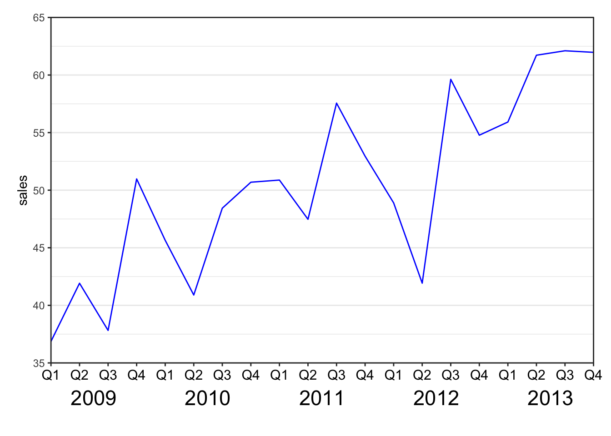

# R plot gallery

#### Contents {-}
+ [Multiple 95% Confidence Intervals](#multiple-95-confidence-intervals)
+ [Pirate Plot](#pirate-plot)
+ [Beeswarm Plot](#beeswarm-plot)
+ [Bar Plot](#bar-plot)
+ [Multi-row x-axis labels](#multi-row-x-axis-labels)
+ [Calender](#calendar)
+ [Correlation Plot](#correlation-plot)
+ [Survival Analysis](#survival-analysis)
+ [Table Visualization](#table-visualization)
+ [Heatmap](#heatmap)
+ [Compare Two Group Means](#compare-two-group-means)
+ [Add p-value](#add-p-value)
+ [Missing Data in Time Series](#missing-data-in-time-series)
+ [State Map with Fill-in Color](#state-map-with-fill-in-color)
+ [Animiation Plot](#animation-plot)

#### Multiple 95% Confidence Intervals {-}

```r
data.frame(value = rnorm(12, mean = 0, sd = 0.05)) %>% 
  mutate(lower = value - runif(12, 0, 0.4), 
         upper = value + runif(12, 0, 0.4), 
         REG = rep(c("A", "B", "C", "D"), 3), 
         est = mean(value), 
         index = rep(1:3, each = 4)) %>% 
  ggplot(aes(x = lower, xend = upper, 
             y = index + rep((0:(length(unique(REG))-1))/10, 3), 
             yend = index + rep((0:(length(unique(REG))-1))/10, 3), 
             color = REG)) + 
  geom_segment(lwd = 1, alpha = 0.5) + 
  scale_color_brewer(palette = "Set1") + 
  labs(y = "", x = "Reduction Rate") + 
  scale_y_continuous(breaks = 1:3, 
                     labels = c("method 1", "method 2", "method 3")) + 
  geom_segment(aes(x = est, xend = est, 
                   y = index - 0.1, 
                   yend = index + (length(unique(REG)))/10)) + 
  geom_point(aes(x = value, 
                 y = index + rep((0:(length(unique(REG))-1))/10,  3))) + 
  theme_bw() + 
  ggtitle("Reduction Rate of Treatment Compared With Placebo") + 
  theme(plot.title = element_text(hjust = 0.5), 
        text= element_text(size = 15))
```


#### Pirate Plot {-}

```r
require(yarrr)

yarrr::pirateplot(weight ~ Diet, 
           data = ChickWeight, 
           main = "Pirate plot", 
           inf.method = "ci", 
           theme = 2,   # change theme, from 1 to 4
           pal = "decision", # use piratepal(palette = "all") to check available palettes 
           bar.f.o = 0.2)
```


#### Beeswarm plot {-}

```r
require(ggbeeswarm)
```

```
## Loading required package: ggbeeswarm
```

```r
ggplot(iris, aes(Species, Sepal.Length, colour = Species)) +
  geom_violin(width = 0.5) +
  geom_beeswarm() +
  theme_classic() +
  scale_color_brewer(palette = "Set1")
```


#### Bar Plot {-}

```r
dat2 <- data.frame(
  categ = rep(c("Roads", "Canals", "Early railways", "Railways"), each = 3) %>% forcats::fct_inorder(), 
  group =  rep(c("Maximum", "Mean", "Minimum"), 4), 
  fill = as.character(c(1,1,1,1,1,1, 2, 1, 3, 1,1,1)), 
  pattern = c(rep("N", 6), "D", rep("N", 5)), 
  record = c(NA, 5, NA, 11.5, 3.77, 1.4, 14.3, 6, 2.3, NA, 1.4, NA)
)


dat2 %>% dplyr::filter(is.na(record) == FALSE) %>% 
ggplot() + 
  geom_bar_pattern(aes(x = categ, y = record, fill = fill, group = group, pattern = pattern), 
                   width=0.4, position = position_dodge2(width=0.5, preserve = "single"), 
                   color = "black", 
                   stat = "identity", 
                  pattern_density = 1.0,
                  pattern_fill = 'grey',
                  pattern_key_scale_factor = 0.5) + 
  scale_fill_manual(values = c("#1B4264","#D3CEC7","#5A6065"), 
                    labels = c("Mean", "Maximum", "Minimum")) +
  scale_pattern_manual(values = c(D = "stripe", N = "none"), guide = "none") + 
  guides(fill = guide_legend(override.aes = list(pattern = "none"), 
                             title = NULL)) + 
  scale_y_continuous(breaks = c(0, 2, 4, 6, 8, 10, 12, 14)) + 
  labs(x = NULL, y = "Pence") + 
  theme_bw() + 
  theme(text = element_text(size = 15), axis.text.y = element_text(angle = 30, hjust = 1)) 
```


```r
getrank <- function(data)
{
  group <- nrow(data)/4
  rankvalue <- NULL
  for(i in 1:group)
  {
    rankvalue <- c(rankvalue, rank(ifelse(data$stat[i*4] %in% c("n_over", "risk"), 1, -1) *      
                                     data$value[((i-1)*4+1):(i*4)], ties.method = "min"))
  }
  data$rank <- as.character(rankvalue)
  return(data)
}

data.frame(curve = rep(1:4, each = 4), 
           design = rep(paste("D", 1:4, sep = ""), 4), 
           correct = runif(16, max = 100), 
           OBD = runif(16, max = 100), 
           noOBD = runif(16, max = 100), 
           risk = runif(16, max = 100)) %>% 
  gather(key = "stat", value = "value", -curve, -design) %>%
  getrank() %>%
  mutate_if(is.numeric, ~round(., 1)) %>%
  mutate(ifbest = as.character(rank == "1")) %>%
  ggplot(aes(x = curve, y = value, fill = design, pattern = ifbest)) +
  geom_bar_pattern(
                   width=0.75, position = position_dodge2(width=0.7, preserve = "single"),
                   color = "black",
                   stat = "identity",
                   pattern_fill = NA,
                  pattern_density = 1.0,
                  pattern_key_scale_factor = 0.5) +
  scale_fill_manual(values = c("#EC8F76","#37BAEB", "#A2E265","#E8EC76" ),
                    labels = c("D1", "D2", "D3", "D4")) +
  scale_pattern_manual(values = c("TRUE" = "stripe", "FALSE" = "none"), guide = "none") +
   guides(fill = guide_legend(override.aes = list(pattern = "none"),
                             title = NULL)) +
  facet_wrap(~factor(stat, levels = c("OBD", "noOBD", "correct", "risk")),
             nrow = 2, scales = "free") +
  geom_text(aes(label=value), position=position_dodge(width=0.7), vjust=-0.25, size = 3) +
  theme_bw()
```


#### Multi-row x-axis labels {-}

```r
set.seed(1)
df=data.frame(year=rep(2009:2013,each=4),
              quarter=rep(c("Q1","Q2","Q3","Q4"),5),
              sales=40:59+rnorm(20,sd=5))

ggplot(data = df, aes(x = interaction(year, quarter, lex.order = TRUE), 
                      y = sales, group = 1)) +
  geom_line(colour = "blue") +
  annotate(geom = "text", x = seq_len(nrow(df)), y = 34, label = df$quarter, size = 4) +
  annotate(geom = "text", x = 2.5 + 4 * (0:4), y = 32, label = unique(df$year), size = 6) +
  coord_cartesian(ylim = c(35, 65), expand = FALSE, clip = "off") +
  theme_bw() +
  theme(plot.margin = unit(c(1, 1, 4, 1), "lines"),
        axis.title.x = element_blank(),
        axis.text.x = element_blank(),
        panel.grid.major.x = element_blank(),
        panel.grid.minor.x = element_blank())
```




```r
ggplot(mtcars, aes(wt, mpg)) +  
  geom_point() +  
  labs(x = paste0("<span style='font-size: 11pt'>This is the axis of</span><br>
                  <span style='font-size: 7pt'>wt</span>"), 
       y = paste0("<span style='font-size: 11pt'>This is the axis of</span><br>
                  <span style='font-size: 7pt'>mpg</span>")) +  
  theme(axis.title.x = ggtext::element_markdown(),
        axis.title.y = ggtext::element_markdown())
```


#### Calendar {-}

```r
require(sugrrants)
```

```
## Loading required package: sugrrants
```

```r
require(lubridate)
```

```
## Loading required package: lubridate
```

```
## 
## Attaching package: 'lubridate'
```

```
## The following objects are masked from 'package:base':
## 
##     date, intersect, setdiff, union
```

```r
data.frame(date = lubridate::ymd(strtrim(seq(ISOdate(2017,10,1), ISOdate(2018,2,28), "DSTday"),10)), 
           # or as.Date("2017-10-1") + 0:150
           n = sample(1:100, size = 151, replace = T)) %>% 
  sugrrants::frame_calendar(x = 1, y = 1, date = date) %>% 
  ggplot(aes(x = .x, y = .y)) +
  ggtitle("Daily sold units") +
  theme_bw() + 
  theme(legend.position = "bottom", 
        plot.title = element_text(hjust = 0.5)) +
  geom_tile(aes(x = .x+(1/13)/2, y = .y+(1/9)/2, fill = n), colour = "grey50") +
  scale_fill_distiller(name = "", palette = "RdYlBu") -> p2.sale 
  sugrrants::prettify(p2.sale, label = c("label", "text", "text2")) # label: month and year; text: weekday at the bottom; text2: day of month
```


#### Correlation Plot {-}

```r
require(corrplot)
```

```
## Loading required package: corrplot
```

```
## corrplot 0.92 loaded
```

```r
cor(mtcars) %>% 
  corrplot::corrplot(., type = "upper", order = "hclust")
```


#### Survival Analysis {-}

```r
library(survival) 
library(survminer)
```

```
## Loading required package: ggpubr
```

```
## 
## Attaching package: 'survminer'
```

```
## The following object is masked from 'package:survival':
## 
##     myeloma
```

```r
surv_model <- survfit(Surv(time, status) ~ sex, data = lung)
p1 <- ggsurvplot(surv_model, data = lung,
           conf.int = TRUE, # 添加置信区间
           pval = TRUE, # 添加p值 (can customize pval)
           fun = "pct", # 将y轴转变为百分比的格式
           size = 1, # 修饰线条的粗细
           linetype = "strata", # 改变两条线条的类型
           palette = c("lightseagreen", "goldenrod1"), # 改变两条曲线的颜色
           legend = c(0.8, 0.85), # 改变legend的位置
           legend.title = "Gender", # 改变legend的题目
           legend.labs = c("Male", "Female"), # 改变legend的标签
           risk.table = TRUE,    # add risk table
           tables.height = 0.2,
           tables.theme = theme_cleantable(),
           surv.median.line = "hv", 
           ggtheme = theme_bw())

p1$plot <- p1$plot + annotate("text", x = 750, y = 70, # 注明x和y轴的位置
           label = "Chisq = 10.3 on 1 degrees of freedom") # 添加文本信息
p1
```


```r
library(ggsurvfit)
mymodel <- survfit2(Surv(time, status) ~ surg, data = df_colon)

ggsurvfit(mymodel) +
  add_confidence_interval() + # 添加置信区间
  scale_color_manual(values = c('#54738E', '#82AC7C')) + # 修改颜色
  scale_fill_manual(values = c('#54738E', '#82AC7C')) + # 修改颜色
  add_risktable() + # 添加风险表格
  theme_minimal() +
  theme(legend.position = "bottom")
```


```r
cox_model <- coxph(Surv(time, status) ~ sex + ph.ecog, data = lung)
ggforest(cox_model)
```

```
## Warning in .get_data(model, data = data): The `data` argument is not provided.
## Data will be extracted from model fit.
```


#### Table Visualization {-}

```r
require(formattable)
```

```
## Loading required package: formattable
```

```r
require(DT)
```

```
## Loading required package: DT
```

```r
df <- 
  data.frame(id = 1:10,  
             name = c("Bob", "Ashley", "James", "David", "Jenny",
                      "Hans", "Leo", "John", "Emily", "Lee"),   
             age = c(28, 27, 30, 28, 29, 29, 27, 27, 31, 30),  
             grade = c("C", "A", "A", "C", "B", "B", "B", "A", "C", "C"),  
             test1_score = c(8.9, 9.5, 9.6, 8.9, 9.1, 9.3, 9.3, 9.9, 8.5, 8.6),
             test2_score = c(9.1, 9.1, 9.2, 9.1, 8.9, 8.5, 9.2, 9.3, 9.1, 8.8),  
             final_score = c(9, 9.3, 9.4, 9, 9, 8.9, 9.25, 9.6, 8.8, 8.7),  
             registered = c(TRUE, FALSE, TRUE, FALSE, TRUE, TRUE, TRUE, FALSE, FALSE, FALSE),
             stringsAsFactors = FALSE)

formattable(df, 
            list(age = color_tile("white", "orange"),
                 grade = formatter("span", 
                                   style = x ~ ifelse(x == "A", style(color = "green", font.weight = "bold"), NA) ),    
                 area(col = c(test1_score, test2_score)) ~ normalize_bar("pink", 0.4),              
                 final_score = formatter("span",  style = x ~ style(color = ifelse(rank(-x) <= 3, "green", "gray")),
                                         x ~ sprintf("%.2f (rank: %02d)", x, rank(-x))),
                 registered = formatter("span", style = x ~ style(color = ifelse(x, "green", "red")),
                                        x ~ icontext(ifelse(x, "ok", "remove"), ifelse(x, "Yes","No")))
                 )
            )
```


<table class="table table-condensed">
 <thead>
  <tr>
   <th style="text-align:right;"> id </th>
   <th style="text-align:right;"> name </th>
   <th style="text-align:right;"> age </th>
   <th style="text-align:right;"> grade </th>
   <th style="text-align:right;"> test1_score </th>
   <th style="text-align:right;"> test2_score </th>
   <th style="text-align:right;"> final_score </th>
   <th style="text-align:right;"> registered </th>
  </tr>
 </thead>
<tbody>
  <tr>
   <td style="text-align:right;"> 1 </td>
   <td style="text-align:right;"> Bob </td>
   <td style="text-align:right;"> <span style="display: block; padding: 0 4px; border-radius: 4px; background-color: #ffe8bf">28</span> </td>
   <td style="text-align:right;"> <span>C</span> </td>
   <td style="text-align:right;"> <span style="display: inline-block; direction: rtl; unicode-bidi: plaintext; border-radius: 4px; padding-right: 2px; background-color: pink; width: 57.14%">8.9</span> </td>
   <td style="text-align:right;"> <span style="display: inline-block; direction: rtl; unicode-bidi: plaintext; border-radius: 4px; padding-right: 2px; background-color: pink; width: 65.71%">9.1</span> </td>
   <td style="text-align:right;"> <span style="color: gray">9.00 (rank: 06)</span> </td>
   <td style="text-align:right;"> <span style="color: green">
  <i class="glyphicon glyphicon-ok"></i>
  Yes
</span> </td>
  </tr>
  <tr>
   <td style="text-align:right;"> 2 </td>
   <td style="text-align:right;"> Ashley </td>
   <td style="text-align:right;"> <span style="display: block; padding: 0 4px; border-radius: 4px; background-color: #ffffff">27</span> </td>
   <td style="text-align:right;"> <span style="color: green; font-weight: bold">A</span> </td>
   <td style="text-align:right;"> <span style="display: inline-block; direction: rtl; unicode-bidi: plaintext; border-radius: 4px; padding-right: 2px; background-color: pink; width: 82.86%">9.5</span> </td>
   <td style="text-align:right;"> <span style="display: inline-block; direction: rtl; unicode-bidi: plaintext; border-radius: 4px; padding-right: 2px; background-color: pink; width: 65.71%">9.1</span> </td>
   <td style="text-align:right;"> <span style="color: green">9.30 (rank: 03)</span> </td>
   <td style="text-align:right;"> <span style="color: red">
  <i class="glyphicon glyphicon-remove"></i>
  No
</span> </td>
  </tr>
  <tr>
   <td style="text-align:right;"> 3 </td>
   <td style="text-align:right;"> James </td>
   <td style="text-align:right;"> <span style="display: block; padding: 0 4px; border-radius: 4px; background-color: #ffbb3f">30</span> </td>
   <td style="text-align:right;"> <span style="color: green; font-weight: bold">A</span> </td>
   <td style="text-align:right;"> <span style="display: inline-block; direction: rtl; unicode-bidi: plaintext; border-radius: 4px; padding-right: 2px; background-color: pink; width: 87.14%">9.6</span> </td>
   <td style="text-align:right;"> <span style="display: inline-block; direction: rtl; unicode-bidi: plaintext; border-radius: 4px; padding-right: 2px; background-color: pink; width: 70.00%">9.2</span> </td>
   <td style="text-align:right;"> <span style="color: green">9.40 (rank: 02)</span> </td>
   <td style="text-align:right;"> <span style="color: green">
  <i class="glyphicon glyphicon-ok"></i>
  Yes
</span> </td>
  </tr>
  <tr>
   <td style="text-align:right;"> 4 </td>
   <td style="text-align:right;"> David </td>
   <td style="text-align:right;"> <span style="display: block; padding: 0 4px; border-radius: 4px; background-color: #ffe8bf">28</span> </td>
   <td style="text-align:right;"> <span>C</span> </td>
   <td style="text-align:right;"> <span style="display: inline-block; direction: rtl; unicode-bidi: plaintext; border-radius: 4px; padding-right: 2px; background-color: pink; width: 57.14%">8.9</span> </td>
   <td style="text-align:right;"> <span style="display: inline-block; direction: rtl; unicode-bidi: plaintext; border-radius: 4px; padding-right: 2px; background-color: pink; width: 65.71%">9.1</span> </td>
   <td style="text-align:right;"> <span style="color: gray">9.00 (rank: 06)</span> </td>
   <td style="text-align:right;"> <span style="color: red">
  <i class="glyphicon glyphicon-remove"></i>
  No
</span> </td>
  </tr>
  <tr>
   <td style="text-align:right;"> 5 </td>
   <td style="text-align:right;"> Jenny </td>
   <td style="text-align:right;"> <span style="display: block; padding: 0 4px; border-radius: 4px; background-color: #ffd27f">29</span> </td>
   <td style="text-align:right;"> <span>B</span> </td>
   <td style="text-align:right;"> <span style="display: inline-block; direction: rtl; unicode-bidi: plaintext; border-radius: 4px; padding-right: 2px; background-color: pink; width: 65.71%">9.1</span> </td>
   <td style="text-align:right;"> <span style="display: inline-block; direction: rtl; unicode-bidi: plaintext; border-radius: 4px; padding-right: 2px; background-color: pink; width: 57.14%">8.9</span> </td>
   <td style="text-align:right;"> <span style="color: gray">9.00 (rank: 06)</span> </td>
   <td style="text-align:right;"> <span style="color: green">
  <i class="glyphicon glyphicon-ok"></i>
  Yes
</span> </td>
  </tr>
  <tr>
   <td style="text-align:right;"> 6 </td>
   <td style="text-align:right;"> Hans </td>
   <td style="text-align:right;"> <span style="display: block; padding: 0 4px; border-radius: 4px; background-color: #ffd27f">29</span> </td>
   <td style="text-align:right;"> <span>B</span> </td>
   <td style="text-align:right;"> <span style="display: inline-block; direction: rtl; unicode-bidi: plaintext; border-radius: 4px; padding-right: 2px; background-color: pink; width: 74.29%">9.3</span> </td>
   <td style="text-align:right;"> <span style="display: inline-block; direction: rtl; unicode-bidi: plaintext; border-radius: 4px; padding-right: 2px; background-color: pink; width: 40.00%">8.5</span> </td>
   <td style="text-align:right;"> <span style="color: gray">8.90 (rank: 08)</span> </td>
   <td style="text-align:right;"> <span style="color: green">
  <i class="glyphicon glyphicon-ok"></i>
  Yes
</span> </td>
  </tr>
  <tr>
   <td style="text-align:right;"> 7 </td>
   <td style="text-align:right;"> Leo </td>
   <td style="text-align:right;"> <span style="display: block; padding: 0 4px; border-radius: 4px; background-color: #ffffff">27</span> </td>
   <td style="text-align:right;"> <span>B</span> </td>
   <td style="text-align:right;"> <span style="display: inline-block; direction: rtl; unicode-bidi: plaintext; border-radius: 4px; padding-right: 2px; background-color: pink; width: 74.29%">9.3</span> </td>
   <td style="text-align:right;"> <span style="display: inline-block; direction: rtl; unicode-bidi: plaintext; border-radius: 4px; padding-right: 2px; background-color: pink; width: 70.00%">9.2</span> </td>
   <td style="text-align:right;"> <span style="color: gray">9.25 (rank: 04)</span> </td>
   <td style="text-align:right;"> <span style="color: green">
  <i class="glyphicon glyphicon-ok"></i>
  Yes
</span> </td>
  </tr>
  <tr>
   <td style="text-align:right;"> 8 </td>
   <td style="text-align:right;"> John </td>
   <td style="text-align:right;"> <span style="display: block; padding: 0 4px; border-radius: 4px; background-color: #ffffff">27</span> </td>
   <td style="text-align:right;"> <span style="color: green; font-weight: bold">A</span> </td>
   <td style="text-align:right;"> <span style="display: inline-block; direction: rtl; unicode-bidi: plaintext; border-radius: 4px; padding-right: 2px; background-color: pink; width: 100.00%">9.9</span> </td>
   <td style="text-align:right;"> <span style="display: inline-block; direction: rtl; unicode-bidi: plaintext; border-radius: 4px; padding-right: 2px; background-color: pink; width: 74.29%">9.3</span> </td>
   <td style="text-align:right;"> <span style="color: green">9.60 (rank: 01)</span> </td>
   <td style="text-align:right;"> <span style="color: red">
  <i class="glyphicon glyphicon-remove"></i>
  No
</span> </td>
  </tr>
  <tr>
   <td style="text-align:right;"> 9 </td>
   <td style="text-align:right;"> Emily </td>
   <td style="text-align:right;"> <span style="display: block; padding: 0 4px; border-radius: 4px; background-color: #ffa500">31</span> </td>
   <td style="text-align:right;"> <span>C</span> </td>
   <td style="text-align:right;"> <span style="display: inline-block; direction: rtl; unicode-bidi: plaintext; border-radius: 4px; padding-right: 2px; background-color: pink; width: 40.00%">8.5</span> </td>
   <td style="text-align:right;"> <span style="display: inline-block; direction: rtl; unicode-bidi: plaintext; border-radius: 4px; padding-right: 2px; background-color: pink; width: 65.71%">9.1</span> </td>
   <td style="text-align:right;"> <span style="color: gray">8.80 (rank: 09)</span> </td>
   <td style="text-align:right;"> <span style="color: red">
  <i class="glyphicon glyphicon-remove"></i>
  No
</span> </td>
  </tr>
  <tr>
   <td style="text-align:right;"> 10 </td>
   <td style="text-align:right;"> Lee </td>
   <td style="text-align:right;"> <span style="display: block; padding: 0 4px; border-radius: 4px; background-color: #ffbb3f">30</span> </td>
   <td style="text-align:right;"> <span>C</span> </td>
   <td style="text-align:right;"> <span style="display: inline-block; direction: rtl; unicode-bidi: plaintext; border-radius: 4px; padding-right: 2px; background-color: pink; width: 44.29%">8.6</span> </td>
   <td style="text-align:right;"> <span style="display: inline-block; direction: rtl; unicode-bidi: plaintext; border-radius: 4px; padding-right: 2px; background-color: pink; width: 52.86%">8.8</span> </td>
   <td style="text-align:right;"> <span style="color: gray">8.70 (rank: 10)</span> </td>
   <td style="text-align:right;"> <span style="color: red">
  <i class="glyphicon glyphicon-remove"></i>
  No
</span> </td>
  </tr>
</tbody>
</table>


#### Heatmap {-}

```r
ggplot(airquality, aes(Day, Month, fill = Temp)) + 
  geom_tile() + 
  scale_x_continuous(breaks = seq(1:31)) + 
  theme_bw() + 
  scale_fill_viridis_c(option = "A") 
```


```r
# Example 2
set.seed(1234)
mydata <- matrix(rnorm(5*10), ncol = 10)
colnames(mydata) <- letters[1:10] 
heatmap(mydata, 
        # Colv = NA, # Rowv = NA,   # hide the clustering 
        main = "heatmap", col = cm.colors(256))
```


#### Compare Two Group Means {-}

```r
require(dabestr)
```

```
## Loading required package: dabestr
```

```
## Loading required package: magrittr
```

```
## 
## Attaching package: 'magrittr'
```

```
## The following object is masked from 'package:tidyr':
## 
##     extract
```

```r
mydata <- iris[iris$Species %in% c("setosa", "versicolor"), ] %>% 
  mutate(Class = ifelse(Sepal.Length > 5.5, "Long", "Short"))

mytest <- dabest(mydata, Species, Petal.Width,    # Compare Petal.Width for Species
                 idx = c("setosa", "versicolor"), # setosa is the control group 
                 paired = FALSE) 

mymean_diff <- mean_diff(mytest)

plot(mymean_diff, color.column = Class)
```


#### Add p-value {-}

```r
ggplot(iris, aes(Species, Sepal.Length)) + 
  geom_boxplot() +
  ggsignif::geom_signif(comparisons = list(c(1, 2)), # group 1 vs group 2
              y_position = 8, 
              tip_length = 0) + 
  ggsignif::geom_signif(comparisons = list(c(1, 3)), 
              y_position = 8.6,
              tip_length = 0) + 
  ggsignif::geom_signif(comparisons = list(c(2, 3)), 
              y_position = 8.3, 
              tip_length = 0)
```


#### Missing Data in Time Series {-}
> [Soure link](https://mp.weixin.qq.com/s/MekOqUwbSeyw4SHNDVcLCQ)


```r
library(imputeTS)
```

```
## Registered S3 method overwritten by 'quantmod':
##   method            from
##   as.zoo.data.frame zoo
```

```r
ggplot_na_distribution(tsAirgap)   
```


```r
data_imputation <- na_interpolation(tsAirgap, option = "linear")    
# linear interpolation; we can also try spline, stine
ggplot_na_imputations(tsAirgap, data_imputation, tsAirgapComplete)
```


#### State Map with Fill-in Color {-}

+ Example 1 

```r
library(usmap)
library(sf)

d <- us_map("counties") %>% dplyr::filter(abbr == "IA")
d$county <- substr(d$county, 1, nchar(d$county) - 7)   # remove string " county"
d$group <- d$county
d <- d %>% arrange(group)

database <- data.frame(county = d$county %>% unique(), 
                       erosion = rbeta(99, 2, 4) * 14) %>% 
  mutate(erolv = cut(erosion, breaks = c(0, 0.5, 1, 1.5, 2, 2.5, 3, 3.5, 4, 4.5, 5:13, 100), 
                     labels = c(paste0("C", 1:19))))

# color code
colorvalues <- c("C1" = "#83858c", "C2" = "#6d7985", "C3" = "#62807c", "C4" = "#4b734c", 
                 "C5" = "#4a734c", "C6" = "#667c3e", "C7" = "#748036", "C8" = "#5f7824", 
                 "C9" = "#978e24", "C10"= "#977f17", "C11"= "#90651b", "C12"= "#8a4c1b", 
                 "C13"= "#82341a", "C14"= "#781e1a", "C15"= "#571528", "C16"= "#3a132b", 
                 "C17"= "#2e1739", "C18"= "#1a0b1d", "C19"= "#110a16")
# polygon 
USS <- lapply(split(d, d$county), function(x) {
  if(length(table(x$piece)) == 1)
  {
    st_polygon(list(cbind(x$x, x$y)))
  }
  else
  {
    st_multipolygon(list(lapply(split(x, x$piece), function(y) cbind(y$x, y$y))))
  }
})

tmp  <- st_sfc(USS, crs = usmap_crs()@projargs)
tmp  <- st_sf(data.frame(database, geometry = tmp))
tmp$centroids <- st_centroid(tmp$geometry)

ggplot() + geom_sf(data = tmp) +
  geom_sf(aes(fill = erolv), color = "white",  data = tmp) +
  geom_sf_text(aes(label = county, geometry = centroids), colour = "black", size = 3.5, data = tmp) +
    scale_fill_manual(values = colorvalues, 
                    labels = c("[0, 0.5)", "[0.5, 1)", "[1, 1.5)", "[1.5, 2)", "[2, 2.5)", 
                               "[2.5, 3)", "[3, 3.5)", "[3.5, 4)", "[4, 4.5)", "[4.5, 5)",
                               "[5, 6)", "[6,7)", "[7, 8)", "[8, 9)", "[9, 10)", "[10, 11)", 
                               "[11, 12)", "[12, 13)", ">= 13")) +    # change legend names and colors 
  ggtitle("Iowa") + 
  guides(fill = guide_legend(title = NULL)) +   # remove legend title
  theme_void() + theme(plot.title = element_text(hjust = 0.5))
```


+ Example 2

```r
library(usmap)
library(sf)
library(survey)
data(api)
d <- us_map("counties") %>% dplyr::filter(abbr == "CA")
d$county <- substr(d$county, 1, nchar(d$county) - 7)
d$group <- d$county
# combine some counties together
d$group[d$county %in% c("Del Norte", "Trinity")] <- "Humboldt"
d$group[d$county %in% c("Siskiyou", "Modoc", "Lassen")] <- "Shasta"
d$group[d$county %in% c("Lake")] <- "Mendocino"
d$group[d$county %in% c("Tehama", "Glenn", "Colusa", "Yuba", "Sierra", "Plumas")] <- "Butte"
d$group[d$county %in% c("Sutter", "Nevada")] <- "Placer"
d$group[d$county %in% c("Napa")] <- "Yolo"
d$group[d$county %in% c("Amador")] <- "Sacramento"
d$group[d$county %in% c("Calaveras")] <- "San Joaquin"
d$group[d$county %in% c("Tuolumne", "Alpine", "Mono", "Mariposa")] <- "Stanislaus"
d$group[d$county %in% c("Kings", "Madera")] <- "Fresno"
d$group[d$county %in% c("Inyo")] <- "San Bernardino"
d$group[d$county %in% c("San Benito")] <- "Monterey"


USS <- lapply(split(d, d$county), function(x) {
  if(length(table(x$piece)) == 1)
  {
    st_polygon(list(cbind(x$x, x$y)))
  }
  else
  {
    st_multipolygon(list(lapply(split(x, x$piece), function(y) cbind(y$x, y$y))))
  }
})

USSgroup <- list()
mygroup <- unique(d$group)
for(i in 1:length(mygroup))
{
  element <- d %>% dplyr::filter(group == mygroup[i]) %>% "$"(county) %>% unique()
  if(length(element) == 1)
  {
    USSgroup[[i]] <- USS[element][[1]]
  }
  else
  {
    tmp <- st_union(USS[element[1]][[1]], USS[element[2]][[1]])
    if(length(element) > 2)
    for(j in 3:length(element))
    {
      tmp <- st_union(tmp, USS[element[j]][[1]])
    }
    USSgroup[[i]] <- tmp
  }
}

names(USSgroup) <- mygroup

# school data: 
data(api)
df <- apipop %>% group_by(cname) %>% summarise(num = n()) %>% 
  add_row(., cname = "Alpine", num = 0) %>% 
  arrange(cname) %>% "colnames<-"(c("county", "num"))

df$group <- df$county
df$group[df$county %in% c("Del Norte", "Trinity")] <- "Humboldt"
df$group[df$county %in% c("Siskiyou", "Modoc", "Lassen")] <- "Shasta"
df$group[df$county %in% c("Lake")] <- "Mendocino"
df$group[df$county %in% c("Tehama", "Glenn", "Colusa", "Yuba", "Sierra", "Plumas")] <- "Butte"
df$group[df$county %in% c("Sutter", "Nevada")] <- "Placer"
df$group[df$county %in% c("Napa")] <- "Yolo"
df$group[df$county %in% c("Amador")] <- "Sacramento"
df$group[df$county %in% c("Calaveras")] <- "San Joaquin"
df$group[df$county %in% c("Tuolumne", "Alpine", "Mono", "Mariposa")] <- "Stanislaus"
df$group[df$county %in% c("Kings", "Madera")] <- "Fresno"
df$group[df$county %in% c("Inyo")] <- "San Bernardino"
df$group[df$county %in% c("San Benito")] <- "Monterey"

dfgroup <- df %>% group_by(group) %>% summarise(num = sum(num))

CA  <- st_sfc(USS, crs = usmap_crs()@projargs)
CA  <- st_sf(data.frame(df, geometry = CA))
CA$centroids <- st_centroid(CA$geometry)

CAgroup  <- st_sfc(USSgroup, crs = usmap_crs()@projargs)
CAgroup <- st_sf(data.frame(dfgroup, geometry = CAgroup))
CAgroup$centroids <- st_centroid(CAgroup$geometry)

# show the number of schools in each county group
ggplot() + geom_sf(data = CA) + 
  geom_sf(aes(fill = group, alpha = 0.4), color = "white",  data = CAgroup) + 
  geom_sf_text(aes(label = num, geometry = centroids), colour = "black", size = 4.5, data = CAgroup) +
  # scale_fill_manual(values = c("#67b5e3",  "#ffada2","#1155b6",
  #                              "#ed4747", "#cccccc"), guide = guide_none()) +
  theme_void() + theme(legend.position='none')
```


#### Animation plot {-}

```r
invisible(capture.output(
  lapply(c("sf", "usmap", "gganimate", "gifski"), require, character.only = TRUE)
))

rawd <- us_map("counties") %>% dplyr::filter(abbr == "IA")
rawd$county <- substr(rawd$county, 1, nchar(rawd$county) - 7)
rawd$group <- rawd$county
d <- rawd %>% arrange(group)
  
  
database <- data.frame(county = rep(d$county %>% unique(), 20),
                       year = rep(2001:2020, each = 99), 
                       Value = round(rbeta(99 * 20, 2, 20) * 100, 1)) %>%
    mutate(level = cut(Value, breaks = c(0, 3, 5, 7, 9, 100), labels = c("VeryLow", "Low", "Medium", "High", "VeryHigh")))
  
colorvalues <- c("VeryHigh" = "#ed4747", "High" = "#ffada2", "Medium" = "#cccccc", "Low" = "#67b5e3", "VeryLow" = "#1155b6")


database <- database %>% arrange(year, county)
  
USS <- lapply(split(d, d$county), function(x) {
  if(length(table(x$piece)) == 1)
  {
    st_polygon(list(cbind(x$x, x$y)))
  }
  else
  {
    st_multipolygon(list(lapply(split(x, x$piece), function(y) cbind(y$x, y$y))))
  }
})
  
spdata  <- st_sfc(USS, crs = usmap_crs()@projargs)
tmp <- data.frame()
for(yr in 2001:2020)
{
  tmp <- rbind(tmp, st_sf(data.frame(database %>% dplyr::filter(year == yr), geometry = spdata)))
}
tmp$centroids <- st_centroid(tmp$geometry)

tmp <- cbind(tmp, do.call(rbind, st_geometry(tmp$centroids)) %>% 
               as_tibble() %>% setNames(c("lon","lat")))
  
originplot = ggplot() + 
  geom_sf(aes(fill = level, alpha = 0.4), color = "white",  data = tmp) +
  scale_fill_manual(values = colorvalues, guide = guide_none()) + 
  theme_void() + theme(legend.position='none', plot.title = element_text(hjust = 0.5))
  
animateplot = originplot +  
  geom_text(aes(y = lat, x = lon, label = Value), 
            colour = "black", size = 4.5, data = tmp) +
  geom_text(data = tmp, 
            aes(x = median(lon), y = min(lat) - abs(max(lat) - min(lat))/4, 
                label = paste("UR In", "Iowa", "In", year)),
            colour = "black", size = 5) +
  transition_states(states = year) 
  
animate(animateplot, renderer = gifski_renderer(), fps = 5, duration = 10)
```

<!-- -->

